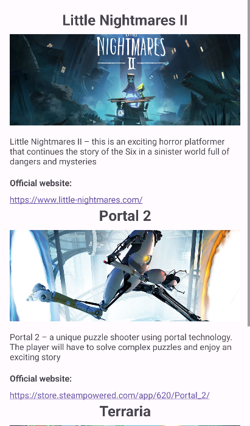
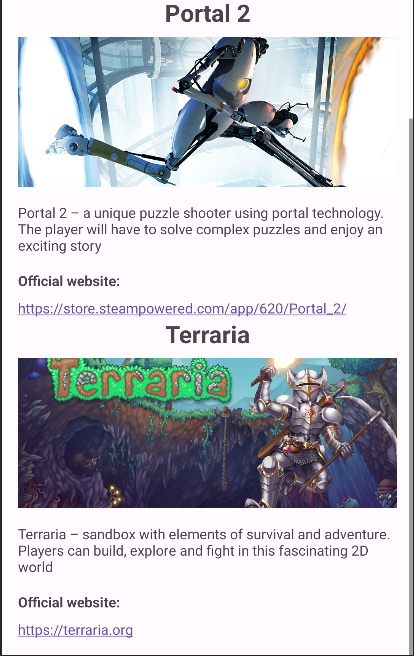

Language : 🇺🇸 | [🇨🇳](./README.zh-CN.md) | [🇷🇺](./README.ru-RU.md) | [🇹🇷](./README.tr-TR.md) | [🇯🇵](./README.ja-JP.md) | [🇫🇷](./README.fr-FR.md) | [🇵🇹](./README.pt-BR.md) | [🇸🇦](./README.ar-DZ.md) | [🇪🇸](./README.es-ES.md)
# Scroling ifomation
This is a program with `information about games`. You can scroll down the page to see more games. This is my `first experience` with links and scrolling page.
<h1 align="center">Importatnt code moments</h1> 

```
<TextView
            android:layout_width="match_parent"
            android:layout_height="wrap_content"
            android:layout_marginTop="8dp"
            android:autoLink="web"
            android:text="https://www.little-nightmares.com/" />
```
`android:autoLink="web"` - is create links to the website

### And offcorse works with images
```
<ImageView
            android:id="@+id/imageViewa"
            android:layout_width="390dp"
            android:layout_height="150dp"
            tools:srcCompat="@drawable/terraria"
            android:scaleType="centerCrop"
            android:adjustViewBounds="true"
            android:layout_marginTop="8dp"/>
```
`android:scaleType="centerCrop"`

`android:adjustViewBounds="true"`

`android:layout_marginTop="8dp"`

This important lines are substitute the image `according to the size of the screen`

#Pictures
|                First 2 game                | The third |
:-------------------------------------------:|:----------|
  |  
